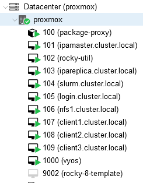

# Ansible playbooks for settings up a Toy HPC Cluster

## Toy Cluster Generation

This includes scripts necessary to build a virtual cluster in an existing Proxmox hypervisor.
The goal is to generate a nice "local" cluster to test integration with cloud clusters. This
currently requires manually configuring a Proxmox hypervisor and virtual router (I used VyOS).

The cluster is configured with FreeIPA as an identity management service with integrated dns,
with a master and replica node. The cluster also includes an NFS server which is mounted on
each appropriate cluster node and authenticated with Kerberos. This also sets up a Slurm cluster
using a fork of the scicore Slurm role with "configless" worker nodes. 

    [jonathan@login ~]$ srun -N3 bash -c 'hostname && ls -l ~'
    client3.cluster.local
    total 0
    -rw-rw-r--. 1 jonathan jonathan 0 Sep 27 21:58 this_is_network_home
    client1.cluster.local
    total 0
    -rw-rw-r--. 1 jonathan jonathan 0 Sep 27 21:58 this_is_network_home
    client2.cluster.local
    total 0
    -rw-rw-r--. 1 jonathan jonathan 0 Sep 27 21:58 this_is_network_home

### Steps

- Create a Proxmox hypervisor with some utility VMs
    - Add an "ansible" user for API use
    - Create a virtual router for your VM subnet, I used VyOS
    - Configure DNS forwarding to IPA master (10.0.1.1) for `cluster.local`
    - Create a utility VM on the VM subnet with ansible and proxmoxer
- Configure a template
    - I used the Rocky 8 qcow2 image with cloud-init
    - I did some minor tweaks to the `/etc/yum.conf` and cloud-init settings
    - I created an LXC container with apt-cacher-ng to keep the repeated yum updates local
- Install Ansible roles/collections
    - `ansible-galaxy install -r requirements.yml`
- Put the necessary secrets in `vm_inventory/group_vars/all`
    - `mkdir -pv vm_inventory/group_vars`
    - `ansible-vault create vm_inventory/group_vars/all`
        - `api_password` - Proxmox password for "ansible@pam" by default
        - `ipaadmin_password` - FreeIPA Admin password
        - `ipadm_password` - FreeIPA directory manager password
        - `slurm_slurmdbd_mysql_password` - Slurm MySQL DB Password
- Provision VMs
    - `ansible-playbook -v provision_vms.yml`
        - Autogens inventory directory for later playbooks
- Install FreeIPA identity management
    - `ansible-playbook -v install_freeipa.yml`
        - Installs FreeIPA server on the server/replica nodes and configures clients
    - You may have to run that (optional: with the tag `-t client`) to ensure all clients
        are actually properly added. Unclear why some sometimes get missed
    - `ansible-playbook -v configure_freeipa.yml`
        - Creates users and sudo rules
- Configure Slurm with scicore playbook
    - `ansible-playbook -v configure_slurm.yml`
        - Sets up a DNS SRV record and builds a slurm cluster with "configless" clients
        - Must be run before NFS setup to ensure users exist
- Set up NFS network automounts
    - Add a VirtualIO drive to the nfs1 VM for storage
        - Cannot be automated with existing proxmox roles. Would need to add my own.
    - `ansible-playbook -v configure_nfs.yml`
        - Sets up storage and installs NFS server
        - Configures NFS with Kerberos authentication on both server and clients
        - Sets up FreeIPA SSSD distribution of automounts for /mnt/data and /home

### Todo

- CLOOOOUUUUUUUD
    - Setup a cluster with ParallelCluster, Batch, or some other tool and integrate it with this one
- Other storage types
    - Provision a Ceph or Lustre storage cluster for "realism"
        - Expect truly awful performance unless I use my NAS or cloud
- Automate more things - low priority
    - Promox setup
    - Router/utility box provisioning
    - Automate creation of Rocky 8 VM template
    - Figure out how to automate creation of a second VHD (proxmox_kvm will not do it)
- Clean up template and make cloud-init work properly
    - Right now all my hosts have the same SSH host keys because my change to cloud-init config didn't do what I thought it would
    - I need to update the template but it is a bit of a pain
- Figure out why sometimes the DNS records don't get created for hosts (not consistent which ones)
    - Incomplete client addition process?
    - Running the `install_freeipa.yml` playbook  again seems to fix this.

### Notes
-
